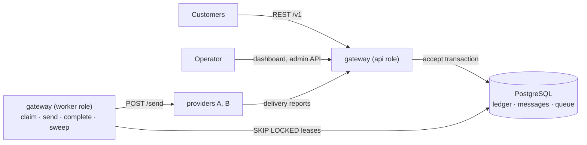

# SMS Gateway

A multi-tenant SMS gateway backend in Go. Customers send messages through a REST API and pay in credits; the gateway dispatches them to SMS providers with retries, failover, circuit breaking, and delivery tracking. An Express service class gets a dedicated lane, reserved provider capacity, and SLA tracking.

The system is designed for **100 million messages per day** (10,000 messages/s at peak) and deploys at minimum scale on a single node. PostgreSQL is both the source of truth and the dispatch queue, so accepting a message, debiting its cost, and enqueueing it are one transaction.

## What it guarantees

- **Credits are exact.** A customer can never spend more than its balance, under any concurrency; every credit movement is a ledger row, and the balance always equals their sum.
- **Accepted means durable.** A `202` is returned only after the message, its debit, and its queue row have committed together.
- **Retries are safe.** Submissions and charges are idempotent by `client_ref`; dispatch is at least once, and providers deduplicate by message ID.
- **Customers are isolated.** Per-customer rate limits at the API, hashed lanes with round-robin claiming in the workers, and a separate lane, pool, and capacity reservation for Express.
- **Failures recover by themselves.** Crashed workers' leases expire and are reclaimed, failing providers are bypassed by circuit breakers, and messages that outlive their TTL are expired and refunded.

These are checked continuously by an invariant checker (`gateway check`) that every integration test, load scenario, and chaos scenario ends with.

## Architecture



One binary runs in the `api`, `worker`, or `all` role; roles communicate only through PostgreSQL. See [Components](docs/020-architecture/020-components.md) and [Request flow](docs/020-architecture/030-request-flow.md).

## Quick start

Requirements: Docker with Compose v2, Go (version in `go.mod`), GNU Make, and [k6](https://k6.io) for load tests.

```sh
make up                     # PostgreSQL, migrations, API, worker, providers A and B
eval "$(make -s seed)"      # demo customers; exports ACME_KEY, BULK_KEY, QUICK_KEY

curl -s -X POST http://localhost:8080/v1/messages \
  -H "Authorization: Bearer $ACME_KEY" -H "Content-Type: application/json" \
  -d '{"to":"+989121234567","text":"Your code is 482913","client_ref":"otp-1"}'
```

| URL | What |
|---|---|
| http://localhost:8080/docs | API reference (Swagger UI) |
| http://localhost:8081/dashboard | Operator dashboard (user `admin`, password `admin`) |
| http://localhost:8081/metrics | Prometheus metrics of the API role |

## Five-minute demo

1. **Send a message** (above) and follow it to `delivered` in the dashboard under Messages; repeat the request to see an idempotent replay.
2. **Credits under concurrency:** `make loadtest SCENARIO=balance-race` sends 1,000 concurrent messages with 100 credits; exactly 100 are accepted.
3. **Fairness:** `make loadtest SCENARIO=noisy-neighbor` floods one customer's lane while another's latency stays low.
4. **Provider outage:** `make loadtest SCENARIO=provider-outage` takes provider A down for a minute; Express fails over, nothing fails, the backlog drains.
5. **Correctness:** `make check` runs the invariant checker against everything that happened.

The full walkthrough is in [Demo walkthrough](docs/010-overview/030-demo-walkthrough.md).

## Repository layout

```
cmd/gateway, cmd/provider   binaries
internal/                   one package per responsibility; see Code organization
migrations/                 SQL schema, embedded in the binary
api/openapi.yaml            customer API specification
loadtest/                   k6 scenarios, chaos scripts, benchmark suite
deploy/                     Dockerfile and compose files
docs/                       design, API, operations, testing, decisions
```

See [Code organization](docs/020-architecture/040-code-organization.md) for package boundaries and dependency rules.

## Testing

| Command | Runs |
|---|---|
| `make test` | Unit tests |
| `make test-integration` | All tests against PostgreSQL, each in its own schema |
| `make loadtest SCENARIO=<name>` | A k6 scenario with pass criteria: `balance-race`, `steady`, `burst`, `noisy-neighbor`, `express-under-load`, `provider-outage`, `provider-chaos` |
| `make chaos SCENARIO=<name>` | Steady load with an injected failure: `worker-kill`, `api-kill`, `provider-restart`, `db-restart` |
| `make bench` | The benchmark suite, with results in `loadtest/results/` |

See [Test strategy](docs/100-testing/010-strategy.md) and [Test scenarios](docs/100-testing/020-scenarios.md).

## Documentation

Start at [docs/README.md](docs/README.md). The most useful entry points:

- [Problem and scope](docs/010-overview/010-problem-and-scope.md)
- [Credits and billing](docs/030-domain/020-credits-and-billing.md)
- [Queue and workers](docs/060-processing/010-queue-and-workers.md)
- [Capacity analysis](docs/080-scalability/010-capacity-analysis.md) for the path to 100M messages/day
- [Architecture decisions](docs/110-decisions/README.md), including why PostgreSQL is the queue and why there is no message broker
