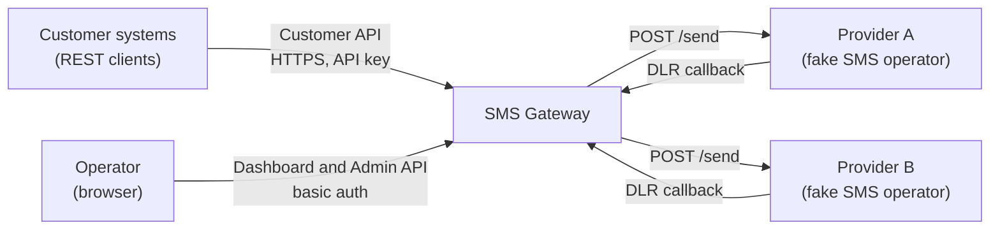

# System Context

Who and what the SMS Gateway interacts with, and across which interfaces.

## Context diagram

## Actors

| Actor | Description | Interacts through |
|---|---|---|
| Customer system | A customer's backend sending SMS | [Customer API](../050-api/020-customer-api.md) on the public port |
| Operator | A person running or demonstrating the gateway | [Dashboard](../090-operations/050-dashboard.md) and [Admin API](../050-api/030-admin-api.md) on the admin port |
| Provider | An SMS operator endpoint | [Provider API and DLR callback](../050-api/040-internal-and-provider-api.md) on the private network |

## External interfaces

| Interface | Direction | Protocol | Authentication | Exposure |
|---|---|---|---|---|
| Customer API `/v1/*` | Customer → gateway | HTTP/JSON | Bearer API key | Public |
| API reference `/docs` | Customer → gateway | HTTP | None | Public |
| Dashboard `/dashboard/*` | Operator → gateway | HTTP/HTML | Basic auth | Private |
| Admin API `/admin/api/*` | Operator → gateway | HTTP/JSON | Basic auth | Private |
| Provider send `POST /send` | Gateway → provider | HTTP/JSON | Private network | Private |
| DLR callback `POST /internal/dlr` | Provider → gateway | HTTP/JSON | Shared secret header | Private |
| Metrics `/metrics` | Scraper → every process | Prometheus text | Private network | Private |

## Trust boundaries

- The public port serves only the customer API, the API reference, and health endpoints. Admin and internal endpoints are bound to a separate port that is not exposed publicly.
- Customer isolation is enforced in every query: a customer can only read or modify rows with its own `customer_id`. Requests for another customer's message return `404`, not `403`, so the existence of the ID is not revealed.
- Providers are trusted only to the extent of the shared DLR secret; DLRs can change message status but never credits.

## Related

- [Components](020-components.md)
- [Problem and scope](../010-overview/010-problem-and-scope.md)
