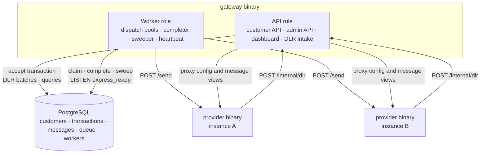

# Components

The deployable components of the system, their responsibilities, and how they connect.

## Component diagram

## Components

### gateway, API role

Serves every HTTP entry point of the gateway.

- **Customer API** on the public port: authentication, rate limiting, validation, pricing, and the accept transaction that debits credits and enqueues messages atomically.
- **Admin API and dashboard** on the admin port: customer management, message inspection, system and provider views.
- **DLR intake** on the admin port: receives provider callbacks and commits them in batches.

State: an in-memory API-key cache and per-customer rate limiters. Both are rebuilt from the database on demand, so instances are disposable and scale horizontally.

### gateway, worker role

Moves messages from the queue to providers.

- **Dispatch pools**: an Express pool serving the `express` lane and a normal pool serving the `normal-*` lanes, each with fixed concurrency.
- **Provider clients**: HTTP clients with timeouts, a circuit breaker per provider, and a rate budget with an Express reservation.
- **Completer**: collects attempt outcomes and commits them in batches.
- **Sweeper**: expiry, SLA flagging, orphan cleanup; one worker runs each sweep cycle, selected by an advisory lock.
- **Heartbeat**: writes the worker's state to the `workers` table every 5 seconds.

State: in-memory circuit breaker and rate budget per process. All message state lives in PostgreSQL, so worker instances scale horizontally and can be killed at any time.

### gateway, all role

Runs the API and worker roles in one process. Used for the simplest local run; functionally identical to running the roles separately.

### provider

A standalone service that simulates an SMS operator: accepts messages, deduplicates by message ID, applies configurable latency and failures, and sends delivery reports back. Two instances (`A` and `B`) run so that failover is observable. See [Fake provider](../060-processing/050-fake-provider.md).

### PostgreSQL

The single source of truth: customers and balances, the credit transaction history, messages, the dispatch queue, and worker heartbeats. It is also the work queue; see [Decision 001](../110-decisions/001-postgres-as-queue.md).

## Ports

| Process | Port | Serves |
|---|---|---|
| gateway (api) | 8080 | `/v1/*`, `/docs`, `/openapi.yaml`, `/healthz`, `/readyz` |
| gateway (api) | 8081 | `/dashboard/*`, `/admin/api/*`, `/internal/dlr`, `/metrics`, `/healthz` |
| gateway (worker) | 8082 | `/metrics`, `/healthz`, `/readyz` |
| provider A | 9001 | `/send`, `/admin/*`, `/metrics`, `/healthz` |
| provider B | 9002 | `/send`, `/admin/*`, `/metrics`, `/healthz` |
| PostgreSQL | 5432 | |

## Communication rules

- The API role and worker role never call each other. They communicate only through PostgreSQL: rows in `queue`, and a `NOTIFY` on the `express_ready` channel when Express messages are enqueued.
- Every state change to a message is a database write guarded by a compare-and-set condition, so concurrent API instances, workers, and DLRs cannot corrupt each other's work.
- All persisted timestamps are produced by the database clock, so clock skew between processes cannot reorder events.

## Related

- [Request flow](030-request-flow.md)
- [Code organization](040-code-organization.md)
- [Decision 002: modular monolith](../110-decisions/002-modular-monolith.md)
- [Deployment](../090-operations/030-deployment.md)
