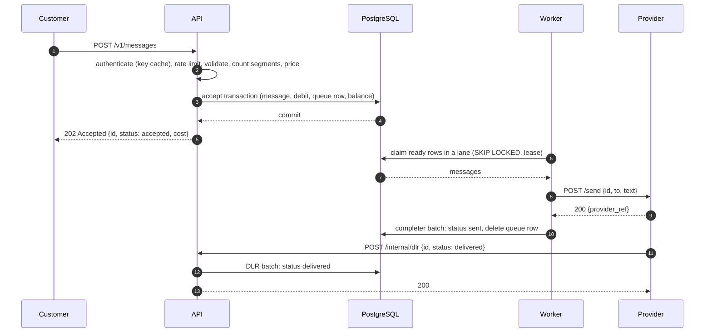

# Request Flow

The path of a single message from the API request to the delivery report, including the exact transaction that accepts it.

## End-to-end sequence



## Step 1: Acceptance (API)

1. **Authenticate.** The bearer key is hashed with SHA-256 and looked up in the in-memory key cache; on a miss, in `customers.api_key_hash`. Cache entries live 30 seconds.
2. **Rate limit.** The customer's token bucket is charged one token per message. An empty bucket returns `429` with `Retry-After`.
3. **Validate.** Recipient format, text presence, type, `client_ref` format. Failures return `422`.
4. **Price.** Encoding detection and segment counting (see [Segments and pricing](../030-domain/030-segments-and-pricing.md)); cost = segments × class price.
5. **Accept transaction.** One database transaction, statements in this order:

```sql
BEGIN;

-- 1. Insert the message. A client_ref conflict inserts nothing (idempotent replay path).
INSERT INTO messages (id, customer_id, type, recipient, body, encoding, segments, cost,
                      client_ref, expires_at)
VALUES ($id, $customer, $type, $to, $text, $encoding, $segments, $cost,
        $client_ref, now() + $ttl)
ON CONFLICT (customer_id, client_ref) DO NOTHING
RETURNING id;
-- no row returned: ROLLBACK, load the existing message, compare payloads (see Idempotency)

-- 2. Record the debit.
INSERT INTO transactions (id, customer_id, kind, amount, message_id)
VALUES ($tx_id, $customer, 'debit', -$cost, $id);

-- 3. Enqueue.
INSERT INTO queue (message_id, lane, expires_at)
VALUES ($id, $lane, now() + $ttl);

-- 4. Debit the balance last, so the customer row lock is held only until commit.
UPDATE customers SET balance = balance - $cost, updated_at = now()
WHERE id = $customer AND balance >= $cost
RETURNING balance;
-- no row returned: ROLLBACK, respond 402 insufficient_credits

-- 5. Express only: wake Express pools. Delivered on commit.
NOTIFY express_ready;

COMMIT;
```

The response is sent only after `COMMIT` succeeds. From that moment the message is durable, paid for, and queued. The ordering puts the balance update last on purpose: the customer row is the only contended row in the transaction, and taking its lock last keeps the lock held for the shortest possible time. See [Credits and billing](../030-domain/020-credits-and-billing.md).

A batch follows the same transaction with multi-row inserts and a single balance update for the total cost.

## Step 2: Dispatch (worker)

1. A pool picks the next lane it serves and claims up to `min(free concurrency, rate budget, 200)` ready rows. Claiming sets `lease_owner` and pushes `next_attempt_at` 30 seconds ahead, which is the lease.
2. Each claimed message is sent by its own goroutine. The provider is chosen by the class's provider-selection rule, subject to circuit state and the rate budget.
3. The outcome (`sent`, `retry`, `deferred`, `failed`, `expired`) goes to the completer.
4. The completer commits outcomes in batches (every 50 ms or 200 outcomes). For `sent`: status becomes `sent`, `sent_at` is set, the queue row is deleted. Details in [Queue and workers](../060-processing/010-queue-and-workers.md).

## Step 3: Delivery report (API)

1. The provider calls `POST /internal/dlr` with the message ID and the delivery outcome.
2. The handler places the report in the DLR batcher and waits.
3. The batcher commits accumulated reports every 50 ms or 500 reports. The status moves to `delivered` or `undelivered` if the message is not already terminal.
4. Each waiting handler returns `200` after its batch commits. A provider that receives no `200` retries the callback. See [Delivery reports](../060-processing/040-delivery-reports.md).

## Variations

| Situation | Flow |
|---|---|
| Provider returns a retryable error | Outcome `retry`: attempts incremented, row returned to the queue with a backoff delay |
| Provider rejects the message | Outcome `failed` with reason `rejected`: message terminal, cost refunded |
| No provider usable (all circuits open) | Outcome `deferred`: row returned to the queue, attempts unchanged |
| Attempts exhausted | Outcome `failed` with reason `attempts_exhausted`, refunded |
| Message past its TTL | Outcome `expired`, refunded |
| DLR arrives before the `sent` commit | Status moves directly from `accepted` to `delivered`; the later completion leaves the status unchanged |

## Related

- [Message lifecycle](../030-domain/010-message-lifecycle.md)
- [Retries and failover](../060-processing/030-retries-and-failover.md)
- [Idempotency](../040-data/020-idempotency.md)
