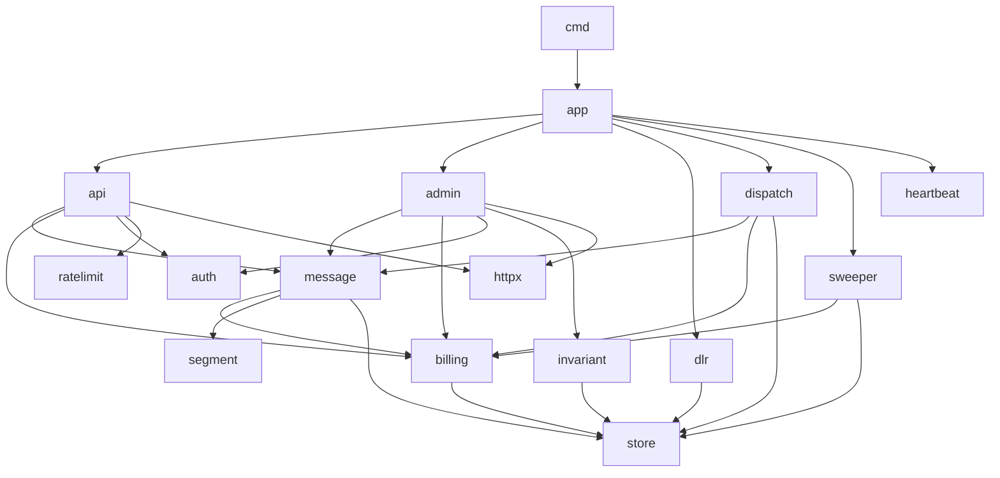

# Code Organization

How the Go codebase is laid out, what each package owns, and which dependencies are allowed.

## Repository layout

```
.
├── cmd/
│   ├── gateway/              gateway binary: serve, migrate, seed, check, probe, version
│   └── provider/             fake provider binary: serve, probe, version
├── internal/
│   ├── app/                  process wiring: builds and runs each role
│   ├── config/               environment parsing and validation
│   ├── logging/              JSON logger construction
│   ├── buildinfo/            version and source revision
│   ├── store/                pgx pool, transaction helper, UUIDv7 bounds,
│   │                         cursors, error classification, migration runner
│   ├── httpx/                JSON decoding, error envelope, middleware,
│   │                         health endpoints, server lifecycle
│   ├── segment/              encoding detection and segment counting (pure)
│   ├── billing/              prices, debit/charge/refund operations, transaction queries
│   ├── message/              accept flow, message queries, reports, state rules
│   ├── auth/                 API key generation, hashing, key cache
│   ├── ratelimit/            per-customer token buckets
│   ├── api/                  customer HTTP handlers, OpenAPI serving
│   ├── dlr/                  DLR handler and batcher
│   ├── dispatch/             pools, claim, provider client, circuit breaker,
│   │                         rate budget, policies, completer
│   ├── sweeper/              expiry, SLA flags, orphan cleanup, lane reassignment
│   ├── heartbeat/            worker registration and stats
│   ├── admin/                admin API, dashboard handlers and templates
│   ├── invariant/            invariant checks
│   ├── metrics/              Prometheus collectors
│   ├── fakeprovider/         fake provider server, simulation, DLR sender
│   └── testutil/             test database and fixtures (tests only)
├── migrations/               SQL migrations, embedded in the binary
├── api/
│   └── openapi.yaml          customer API specification
├── loadtest/                 k6 scenarios, benchmarks, chaos scripts
├── deploy/
│   ├── Dockerfile            multi-stage build of both binaries
│   ├── docker-compose.yml
│   ├── docker-compose.bench.yml
│   └── .env.example
├── .github/workflows/ci.yml  lint, tests against PostgreSQL, image build
├── docs/
├── Makefile
└── go.mod
```

## Binaries and commands

Configuration comes only from environment variables; flags select what to run. Both binaries use the standard `flag` package with a small subcommand dispatcher.

| Command | Purpose |
|---|---|
| `gateway serve [--role=api\|worker\|all]` | Run the gateway in the given role until `SIGINT` or `SIGTERM`; default role `all` |
| `gateway migrate [up\|down\|status]` | Apply pending migrations (default), revert the latest one, or list them |
| `gateway seed` | Create the demo customers, or rotate their keys if they exist, and print `NAME_KEY=sk_...` lines suitable for `eval` |
| `gateway check [--json]` | Run the invariant checks; exit code `0` if all pass |
| `gateway probe [--timeout=2s] <url>` | Request a health URL; exit code `0` on `200`. Used by container health checks, since the runtime image has no shell tools |
| `gateway version` | Print version, source revision, and Go version |
| `provider [serve]` | Run a fake provider; name, port, and simulation settings come from configuration |
| `provider probe <url>`, `provider version` | As for `gateway` |

| Exit code | Meaning |
|---|---|
| `0` | Success |
| `1` | Runtime failure, or `check` found violations |
| `2` | Usage or configuration error; every invalid variable is listed |

## Package responsibilities

| Package | Owns | Must not |
|---|---|---|
| `segment` | GSM-7/UCS-2 detection, segment counting | Depend on anything outside the standard library |
| `billing` | Prices, all SQL touching `customers.balance` and `transactions` | Know about HTTP |
| `message` | The accept transaction, message SQL, report queries | Call providers |
| `dispatch` | Everything between claiming a queue row and completing it | Serve HTTP |
| `dlr` | DLR validation, batching, status SQL for DLRs | Touch credits |
| `api`, `admin` | HTTP concerns: decoding, validation messages, status codes | Contain SQL |
| `store` | Connection pool, `WithTx` helper, UUIDv7 time bounds, cursors, migration runner | Contain domain logic |
| `httpx` | JSON handling, error envelope, middleware, health endpoints, server lifecycle | Know about any domain |
| `app` | Constructing components for a role and running them together | Contain business rules |

## Dependency rules



- Dependencies point downward only. `store`, `httpx`, and `segment` are leaves with respect to domain packages.
- HTTP packages (`api`, `admin`, `dlr` handler) never contain SQL; domain packages never import `net/http`.
- Credits change only through functions in `billing`, each of which takes a `pgx.Tx`, so every credit movement is part of a caller's transaction and always paired with a `transactions` row.
- SQL is hand-written, lives next to the code that uses it, and is covered by integration tests against a real PostgreSQL.

## Libraries

| Concern | Library |
|---|---|
| HTTP routing | Standard library `net/http` (method and path patterns) |
| PostgreSQL | `github.com/jackc/pgx/v5`, `pgxpool` |
| Migrations | In-repo runner in `store` (about 200 lines): versioned SQL files embedded with `embed`, one transaction per migration, advisory lock against concurrent runs |
| UUIDv7 | `github.com/google/uuid` |
| Rate limiting | `golang.org/x/time/rate` |
| Bounded concurrency | `golang.org/x/sync/errgroup` |
| Metrics | `github.com/prometheus/client_golang` |
| Logging | Standard library `log/slog`, JSON handler |
| Dashboard | Standard library `html/template`, htmx, assets embedded with `embed` |
| Integration tests | Any PostgreSQL reachable through `TEST_DATABASE_URL`; each test runs in its own schema |
| Load tests | k6 |

## Related

- [Components](020-components.md)
- [Decision 002: modular monolith](../110-decisions/002-modular-monolith.md)
- [Test strategy](../100-testing/010-strategy.md)
