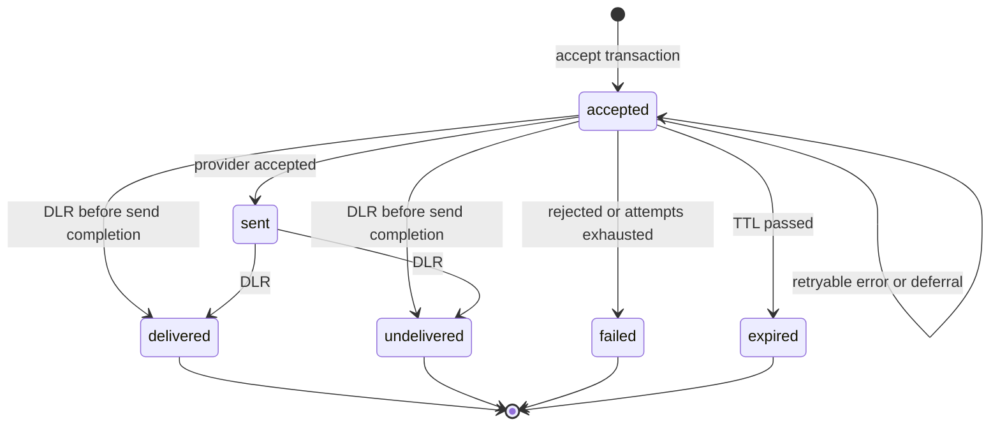

# Message Lifecycle

The statuses a message moves through, what causes each transition, and the rules that keep transitions correct under concurrency.

## Statuses

| Status | Terminal | Meaning |
|---|---|---|
| `accepted` | No | Paid for and queued. Includes messages waiting for a retry. |
| `sent` | No | A provider accepted the message. Waiting for a delivery report. |
| `delivered` | Yes | The provider reported delivery to the handset. |
| `undelivered` | Yes | The provider reported that delivery failed after acceptance. Not refunded. |
| `failed` | Yes | No provider accepted the message: permanently rejected or attempts exhausted. Refunded. |
| `expired` | Yes | The message's TTL passed before any provider accepted it. Refunded. |

Whether a message is currently being attempted is not a status; it is visible as a lease on its queue row. This keeps one write per message off the hot path.

## State diagram

## Transitions

| From | To | Trigger | Side effects |
|---|---|---|---|
| — | `accepted` | Accept transaction | Debit transaction, balance decreased, queue row created |
| `accepted` | `accepted` | Retryable provider error | `attempts` + 1, `last_error` set, queue row delayed by backoff |
| `accepted` | `accepted` | Deferral (no usable provider) | Queue row delayed; `attempts` unchanged |
| `accepted` | `sent` | Provider returned `200` | `sent_at`, `provider`, `provider_ref` set, `attempts` + 1, queue row deleted, Express SLA evaluated |
| `accepted`, `sent` | `delivered`, `undelivered` | DLR | `completed_at` set |
| `accepted` | `failed` | Provider rejection, or attempts exhausted | `failure_reason`, `completed_at` set, refund transaction, balance increased, queue row deleted |
| `accepted` | `expired` | TTL reached (at claim time, when scheduling a retry, or by the sweeper) | Same as `failed`, with `failure_reason = expired` |

## Rules

**Compare-and-set.** Every status change is an `UPDATE … WHERE id = $id AND status IN (<allowed sources>)`. If the row is no longer in an allowed source status, the update affects zero rows and the caller treats the event as already superseded. No transition reads status and writes it in separate steps.

**Terminal statuses are final.** No transition leaves `delivered`, `undelivered`, `failed`, or `expired`.

**Refunds happen exactly once.** Only the `accepted → failed` and `accepted → expired` transitions refund, and only for rows the compare-and-set actually changed. The unique index on `transactions (message_id, kind)` makes a second refund impossible even under a logic error.

**DLRs may arrive before the send completes.** A provider can call back before the worker's `sent` update commits. The DLR therefore accepts `accepted` as a source status. The completer's later `sent` update records `provider`, `provider_ref`, and `sent_at` but leaves the terminal status in place.

**Late DLRs for failed messages are ignored.** If a provider accepted a message but every response was lost (timeouts), the gateway may mark it `failed` and refund it; a later `delivered` DLR does not change the terminal status. It is counted in `sms_dlr_received_total{outcome="ignored_terminal"}`. The customer is not charged for a message that was in fact delivered; this is the accepted trade-off of refunding on failure.

**Messages without a DLR stay `sent`.** A provider that never reports delivery leaves the message `sent` permanently. `sent` means "handed to the operator", which is the strongest statement the gateway can make without a report.

## Timestamps

| Column | Set when |
|---|---|
| `accepted_at` | Accept transaction |
| `expires_at` | Accept transaction: `accepted_at` + class TTL |
| `sent_at` | First successful provider response is committed |
| `completed_at` | Message enters a terminal status |
| `updated_at` | Every change |

## Failure reasons

| `failure_reason` | Status | Cause |
|---|---|---|
| `rejected` | `failed` | A provider answered with a permanent error (4xx other than 429) |
| `attempts_exhausted` | `failed` | The class's maximum attempts were used without success |
| `expired` | `expired` | The TTL passed, or the next retry would fall after the TTL |

## Related

- [Credits and billing](020-credits-and-billing.md)
- [Queue and workers](../060-processing/010-queue-and-workers.md)
- [Delivery reports](../060-processing/040-delivery-reports.md)
