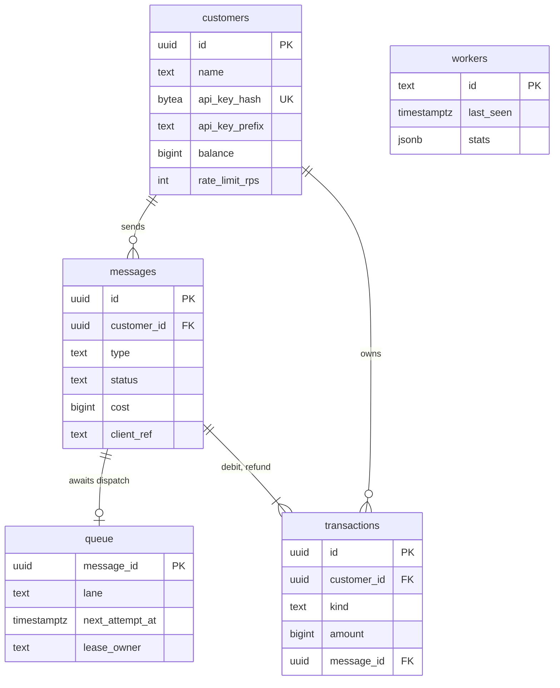

# Schema

The PostgreSQL schema: five tables, their constraints and indexes, and why each exists.

## Entity relationships



## General rules

- Primary keys are UUIDv7, generated by the application. UUIDv7 values sort by creation time, which makes the primary key index usable for time-range queries and keyset pagination (see [Time-ordered IDs](#time-ordered-ids)).
- All timestamps are `TIMESTAMPTZ` and written with the database's `now()`, or `now() + interval`. Application clocks never write state.
- Enumerations are `TEXT` with `CHECK` constraints rather than PostgreSQL enum types, so adding a value is a single-statement migration.
- Deleting a customer cascades to all of its rows.

## customers

```sql
CREATE TABLE customers (
    id              UUID PRIMARY KEY,
    name            TEXT NOT NULL CHECK (length(name) BETWEEN 1 AND 100),
    api_key_hash    BYTEA NOT NULL UNIQUE,
    api_key_prefix  TEXT NOT NULL,
    balance         BIGINT NOT NULL DEFAULT 0 CHECK (balance >= 0),
    rate_limit_rps  INTEGER NOT NULL DEFAULT 100 CHECK (rate_limit_rps BETWEEN 1 AND 100000),
    created_at      TIMESTAMPTZ NOT NULL DEFAULT now(),
    updated_at      TIMESTAMPTZ NOT NULL DEFAULT now()
);
```

| Column | Notes |
|---|---|
| `api_key_hash` | SHA-256 of the full API key. Lookup is by this unique index. |
| `api_key_prefix` | First 12 characters of the key (`sk_` plus 9), shown in the dashboard to identify a key without revealing it. |
| `balance` | Projection of `transactions`; see [Credits and billing](../030-domain/020-credits-and-billing.md). |
| `rate_limit_rps` | Messages per second the customer may submit. |

## messages

```sql
CREATE TABLE messages (
    id              UUID PRIMARY KEY,
    customer_id     UUID NOT NULL REFERENCES customers (id) ON DELETE CASCADE,
    type            TEXT NOT NULL CHECK (type IN ('normal', 'express')),
    recipient       TEXT NOT NULL,
    body            TEXT NOT NULL,
    encoding        TEXT NOT NULL CHECK (encoding IN ('gsm7', 'ucs2')),
    segments        SMALLINT NOT NULL CHECK (segments BETWEEN 1 AND 10),
    cost            BIGINT NOT NULL CHECK (cost > 0),
    status          TEXT NOT NULL DEFAULT 'accepted'
                    CHECK (status IN ('accepted', 'sent', 'delivered', 'undelivered', 'failed', 'expired')),
    attempts        INTEGER NOT NULL DEFAULT 0,
    provider        TEXT,
    provider_ref    TEXT,
    last_error      TEXT,
    failure_reason  TEXT CHECK (failure_reason IN ('rejected', 'attempts_exhausted', 'expired')),
    sla_breached    BOOLEAN NOT NULL DEFAULT false,
    client_ref      TEXT,
    accepted_at     TIMESTAMPTZ NOT NULL DEFAULT now(),
    expires_at      TIMESTAMPTZ NOT NULL,
    sent_at         TIMESTAMPTZ,
    completed_at    TIMESTAMPTZ,
    updated_at      TIMESTAMPTZ NOT NULL DEFAULT now(),
    UNIQUE (customer_id, client_ref),
    CHECK ((status IN ('failed', 'expired')) = (failure_reason IS NOT NULL))
);

CREATE INDEX messages_customer_idx ON messages (customer_id, id DESC);
```

| Column | Notes |
|---|---|
| `recipient` | E.164, validated before insert. |
| `provider`, `provider_ref` | The provider that accepted the message and its reference. `provider` is also set on failed attempts to show the last provider tried. |
| `last_error` | Human-readable error of the latest failed attempt, for operators. Not exposed in the customer API. |
| `failure_reason` | Public reason for `failed` and `expired`; required exactly for those statuses. |
| `client_ref` | Optional customer idempotency key. `NULL` values do not conflict. |

`messages_customer_idx` serves every customer-scoped query: single lookups, listings with keyset pagination, time-range filters (through UUIDv7 bounds), and summary reports. Status and type filters are applied to rows found through this index.

## transactions

```sql
CREATE TABLE transactions (
    id           UUID PRIMARY KEY,
    customer_id  UUID NOT NULL REFERENCES customers (id) ON DELETE CASCADE,
    kind         TEXT NOT NULL CHECK (kind IN ('charge', 'debit', 'refund')),
    amount       BIGINT NOT NULL,
    message_id   UUID REFERENCES messages (id) ON DELETE CASCADE,
    client_ref   TEXT,
    created_at   TIMESTAMPTZ NOT NULL DEFAULT now(),
    CHECK ((kind = 'debit' AND amount < 0) OR (kind IN ('charge', 'refund') AND amount > 0)),
    CHECK ((kind = 'charge') = (message_id IS NULL)),
    CHECK ((kind = 'charge') = (client_ref IS NOT NULL))
);

CREATE UNIQUE INDEX transactions_message_kind_uidx ON transactions (message_id, kind)
    WHERE message_id IS NOT NULL;
CREATE UNIQUE INDEX transactions_charge_ref_uidx ON transactions (customer_id, client_ref)
    WHERE kind = 'charge';
CREATE INDEX transactions_customer_idx ON transactions (customer_id, id DESC);
```

The constraints make these properties structural rather than a matter of application discipline:

- A debit is always negative; charges and refunds are always positive.
- Debits and refunds always reference a message; charges never do.
- A message has at most one debit and at most one refund.
- A charge always has a `client_ref`, unique per customer.

## queue

```sql
CREATE TABLE queue (
    message_id       UUID PRIMARY KEY REFERENCES messages (id) ON DELETE CASCADE,
    lane             TEXT NOT NULL,
    next_attempt_at  TIMESTAMPTZ NOT NULL DEFAULT now(),
    lease_owner      TEXT,
    expires_at       TIMESTAMPTZ NOT NULL
) WITH (fillfactor = 70,
        autovacuum_vacuum_scale_factor = 0.01,
        autovacuum_vacuum_cost_delay = 0);

CREATE INDEX queue_lane_ready_idx ON queue (lane, next_attempt_at);
CREATE INDEX queue_expires_idx ON queue (expires_at);
```

One row exists per message that still needs dispatch work. Rows are deleted when the message is sent or reaches a terminal status, so the table holds only the backlog and stays small while messages flow.

A row's state is derived from two columns:

| State | Condition |
|---|---|
| Ready | `lease_owner IS NULL AND next_attempt_at <= now()` |
| Delayed (backoff or deferral) | `lease_owner IS NULL AND next_attempt_at > now()` |
| In flight (leased) | `lease_owner IS NOT NULL AND next_attempt_at > now()` |
| Lease expired | `lease_owner IS NOT NULL AND next_attempt_at <= now()` |

Claiming sets `next_attempt_at` to the lease deadline, so a single condition, `next_attempt_at <= now()`, selects both ready rows and rows whose lease expired. Recovery from a crashed worker needs no separate process. See [Queue and workers](../060-processing/010-queue-and-workers.md).

`expires_at` is copied from the message so that the sweeper can find expired backlog without touching `messages`.

The storage parameters address the table's workload: every row is inserted, updated at least once, and deleted. A lower `fillfactor` leaves room for updates in the same page, and aggressive autovacuum settings keep dead rows from accumulating.

## workers

```sql
CREATE TABLE workers (
    id          TEXT PRIMARY KEY,
    role        TEXT NOT NULL,
    started_at  TIMESTAMPTZ NOT NULL,
    last_seen   TIMESTAMPTZ NOT NULL,
    stats       JSONB NOT NULL DEFAULT '{}'
);
```

Each worker process upserts its row every 5 seconds. `id` is `<hostname>-<pid>-<random>`. A worker is shown as stale when `last_seen` is older than 15 seconds; rows older than 1 hour are deleted by the sweeper.

`stats` has this shape:

```json
{
  "pools": {
    "express": { "concurrency": 64,  "in_flight": 3 },
    "normal":  { "concurrency": 256, "in_flight": 211 }
  },
  "counters": { "sent": 918233, "retried": 1204, "deferred": 0, "failed": 17, "expired": 0 },
  "circuits": { "A": "closed", "B": "closed" }
}
```

Counters are cumulative since the process started; the admin API derives rates from the difference between consecutive heartbeats.

## Time-ordered IDs

UUIDv7 embeds a millisecond timestamp in its most significant bits. For a time `t`, the smallest UUIDv7 with that timestamp is a lower bound for every ID generated at or after `t`. The `store` package converts time filters into ID bounds:

```sql
-- messages of a customer accepted in [since, until)
SELECT ... FROM messages
WHERE customer_id = $1 AND id >= $lower_bound(since) AND id < $lower_bound(until)
ORDER BY id DESC;
```

This lets `messages_customer_idx` serve time-range queries without an additional index on `accepted_at`. IDs are generated in the application immediately before the insert, so the embedded time differs from `accepted_at` by milliseconds; filters are exact with respect to the ID timestamp.

## Migrations

Migrations are SQL files in `migrations/` named `<version>_<name>.sql`, embedded in the binary, and applied by `gateway migrate`. Each file has a `-- migrate:up` section and a `-- migrate:down` section.

- Each migration runs in its own transaction together with its row in `schema_migrations (version, name, applied_at)`, so a migration is either fully applied and recorded or not at all.
- The runner holds a PostgreSQL advisory lock for the whole run, so concurrent `gateway migrate` processes (for example, several deployments starting at once) apply each migration exactly once.
- `gateway migrate status` lists every migration with its applied time; `gateway migrate down` reverts the most recent one.

## Retention

The deployed configuration keeps all rows. At the target volume the `messages` and `transactions` tables grow by roughly 50–60 GB per day; partitioning and retention are described in [Scaling path](../080-scalability/030-scaling-path.md).

## Related

- [Idempotency](020-idempotency.md)
- [Message lifecycle](../030-domain/010-message-lifecycle.md)
- [Decision 009: UUIDv7 identifiers](../110-decisions/009-uuidv7-identifiers.md)
