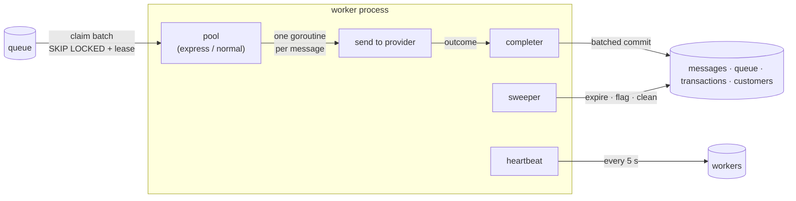
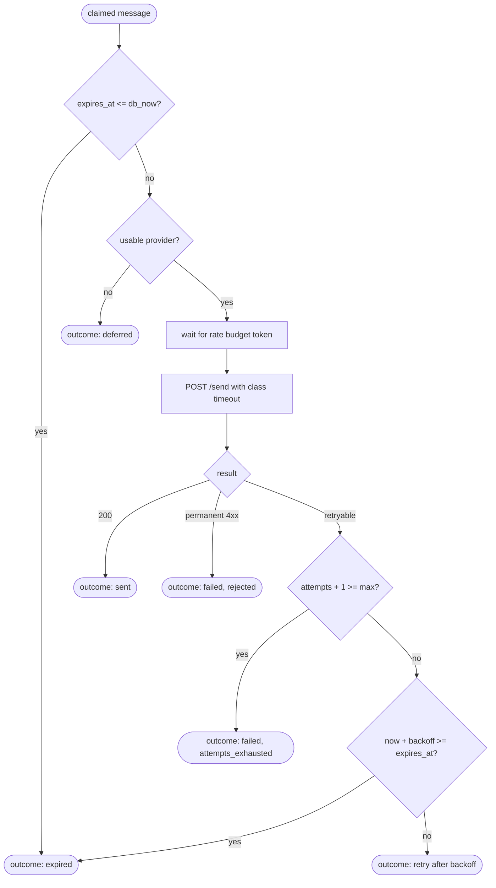

# Queue and Workers

How messages move from the `queue` table to providers: claiming, leases, the dispatch loop, batched completion, the sweeper, and shutdown.

## Overview



A worker process contains two pools (Express and normal), one completer shared by both, one heartbeat, and one sweeper. Any number of worker processes can run; they coordinate only through row locks and leases in PostgreSQL.

## Claiming

A pool claims ready rows from one lane:

```sql
WITH picked AS (
    SELECT q.message_id
    FROM queue q
    JOIN messages m ON m.id = q.message_id AND m.status = 'accepted'
    WHERE q.lane = $lane
      AND q.next_attempt_at <= now()
    ORDER BY q.next_attempt_at
    LIMIT $n
    FOR UPDATE OF q SKIP LOCKED
)
UPDATE queue q
SET lease_owner = $worker_id,
    next_attempt_at = now() + $lease_duration
FROM picked, messages m
WHERE q.message_id = picked.message_id
  AND m.id = q.message_id
RETURNING m.id, m.customer_id, m.type, m.recipient, m.body, m.attempts,
          m.expires_at, now() AS db_now;
```

- `FOR UPDATE SKIP LOCKED` lets many workers claim from the same lane concurrently without blocking and without claiming the same row twice.
- Setting `next_attempt_at` to the lease deadline is the lease. The condition `next_attempt_at <= now()` then matches both never-claimed rows and rows whose lease expired, so a crashed worker's messages are reclaimed by the ordinary claim query.
- `ORDER BY next_attempt_at` serves the oldest ready work in the lane first.
- `db_now` gives the dispatch goroutines the database time for expiry decisions.
- Only messages still `accepted` are claimed. A queue row whose message a delivery report already finalized is left for the sweeper to remove, so a delivered message is never sent again.

The lease duration is 30 seconds (`LEASE_DURATION`). It must exceed the provider timeout plus the completer's flush interval by a wide margin; the configuration loader rejects a lease shorter than three times the largest provider timeout.

## Pool loop

Each pool runs this loop:

1. **Check provider availability.** If no provider is usable for the pool's class (every circuit open), sleep until the earliest circuit allows a probe, then continue.
2. **Size the claim.** `n = min(free concurrency, CLAIM_BATCH_SIZE, rate budget available in the next second)`. Bounding `n` by the rate budget ensures claimed messages start sending within about a second, well inside the lease.
3. **Pick a lane.** The Express pool has one lane. The normal pool rotates round-robin through `normal-0 … normal-(NORMAL_LANES-1)`; see [Lanes and fairness](020-lanes-and-fairness.md).
4. **Claim** up to `n` rows from the lane.
5. **Dispatch.** Start one goroutine per claimed message, bounded by the pool's concurrency.
6. **Idle.** If a full rotation over the pool's lanes returns no rows, wait `POLL_INTERVAL` (100 ms). The Express pool also wakes immediately on `NOTIFY express_ready`.

## Dispatching one message



Provider selection, error classification, backoff, and circuit breaking are in [Retries and failover](030-retries-and-failover.md).

## Completer

Dispatch goroutines hand outcomes to the completer through a channel. The completer commits accumulated outcomes in one transaction when 200 outcomes are pending or 50 ms have passed since the first pending outcome (`COMPLETER_BATCH_SIZE`, `COMPLETER_FLUSH_INTERVAL`). Batching turns thousands of per-message commits into a few dozen per second.

Outcomes in a batch are sorted by message ID before they are applied, and the DLR batcher sorts the same way, so concurrent transactions lock message rows in the same order. Every statement is guarded twice: message updates by a status compare-and-set, and queue changes by `lease_owner = $worker_id`. If a lease expired and another worker reclaimed the row, the stale worker's queue changes affect zero rows, and its message update is either still valid (the provider deduplicates the second send) or superseded.

**sent**

```sql
UPDATE messages m
SET status = CASE WHEN m.status = 'accepted' THEN 'sent' ELSE m.status END,
    sent_at = COALESCE(m.sent_at, now()),
    provider = r.provider,
    provider_ref = r.provider_ref,
    attempts = m.attempts + 1,
    sla_breached = m.sla_breached
                   OR (m.type = 'express' AND now() - m.accepted_at > $express_sla),
    updated_at = now()
FROM unnest($ids::uuid[], $providers::text[], $refs::text[]) AS r(id, provider, provider_ref)
WHERE m.id = r.id AND m.status NOT IN ('failed', 'expired');

DELETE FROM queue WHERE message_id = ANY($ids) AND lease_owner = $worker_id;
```

A status already set to `delivered` or `undelivered` by an early DLR is preserved.

**retry**

```sql
UPDATE messages m
SET attempts = m.attempts + 1, provider = r.provider, last_error = r.error, updated_at = now()
FROM unnest($ids::uuid[], $providers::text[], $errors::text[]) AS r(id, provider, error)
WHERE m.id = r.id AND m.status = 'accepted'
RETURNING m.id;

UPDATE queue q
SET lease_owner = NULL, next_attempt_at = now() + r.delay
FROM unnest($returned_ids::uuid[], $delays::interval[]) AS r(id, delay)
WHERE q.message_id = r.id AND q.lease_owner = $worker_id;
```

Queue rows of messages that did not match (already terminal through a DLR) are deleted instead.

**deferred**: only the queue row changes: `lease_owner = NULL`, `next_attempt_at = now() + CIRCUIT_OPEN_DURATION`. `attempts` is unchanged.

**failed** and **expired**: the status compare-and-set from `accepted`, the refund for exactly the returned rows, and the queue row deletion, as shown in [Credits and billing](../030-domain/020-credits-and-billing.md#refunds). Balance updates are applied one per customer in ascending `customer_id` order, so concurrent completers and the sweeper cannot deadlock.

If a completer transaction fails, it is retried up to 3 times with a short backoff. If it still fails, the outcomes are dropped and the leases expire; the messages are then reclaimed and attempted again, which is safe because providers deduplicate by message ID.

## Heartbeat

Every 5 seconds each worker upserts its row in `workers` with pool concurrency, in-flight counts, cumulative outcome counters, and circuit states. See [Schema](../040-data/010-schema.md#workers).

## Sweeper

The sweeper runs every 10 seconds (`SWEEP_INTERVAL`) in every worker process. Each task runs in its own transaction that begins with `pg_try_advisory_xact_lock(<task id>)`; if another worker holds the lock, the task is skipped for this cycle. Each task processes at most 1,000 rows per cycle.

| Task | Action |
|---|---|
| Expire backlog | Queue rows with `expires_at <= now()` that are not in flight: message → `expired`, refund, delete queue row. Needed when no worker is claiming, for example during a full provider outage. |
| Flag Express SLA | Express messages still `accepted` longer than `EXPRESS_SLA`: set `sla_breached = true`. |
| Remove orphans | Queue rows whose message is terminal and that are not in flight: delete. They appear when a DLR finalizes a message that was waiting for a retry. |
| Reassign lanes | Queue rows in `normal-k` with `k >= NORMAL_LANES`: move to `normal-(hash mod NORMAL_LANES)`. Needed only after lowering `NORMAL_LANES`. |
| Clean workers | Delete `workers` rows with `last_seen` older than 1 hour. |
| Sample queue depth | Update the `sms_queue_depth` and `sms_queue_oldest_ready_seconds` gauges. This task takes no lock: every worker samples, so each worker's metrics show the whole queue. |

## Shutdown

On `SIGTERM` or `SIGINT` a worker:

1. Stops claiming and stops listening for notifications.
2. Waits up to 10 seconds (`SHUTDOWN_TIMEOUT`) for in-flight sends to finish.
3. Flushes the completer.
4. Deletes its `workers` row and exits.

Messages whose sends did not finish in time keep their lease until it expires and are then reclaimed by other workers.

## Related

- [Lanes and fairness](020-lanes-and-fairness.md)
- [Retries and failover](030-retries-and-failover.md)
- [Decision 001: PostgreSQL as the queue](../110-decisions/001-postgres-as-queue.md)
- [Failure modes](../070-reliability/010-failure-modes.md)
