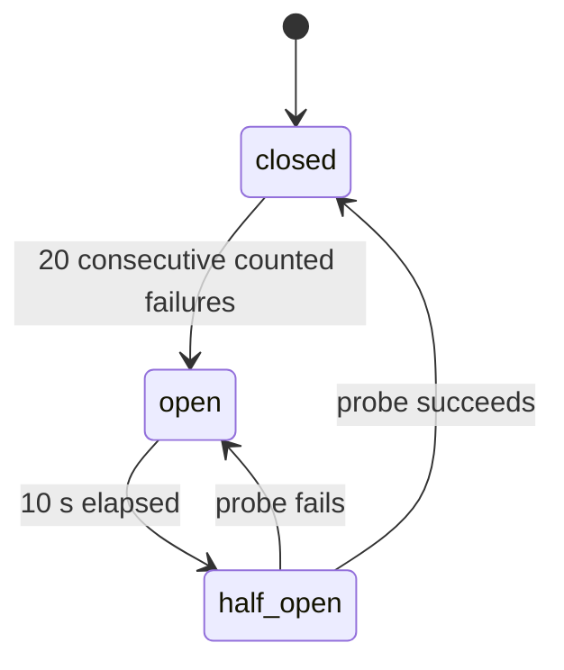

# Retries and Failover

How workers classify provider responses, when and how they retry, how they choose providers, and how circuit breakers contain provider failures.

## Error classification

| Provider result | Class | Counts for circuit breaker |
|---|---|---|
| `200` | Success | Resets the failure count |
| `400`, other `4xx` except `429` | Permanent | No |
| `429` | Retryable | No |
| `5xx` | Retryable | Yes |
| Timeout | Retryable, outcome unknown | Yes |
| Connection refused, reset, DNS failure | Retryable | Yes |

A permanent error ends the message as `failed` with reason `rejected` and refunds it. A retryable error schedules another attempt unless the attempt limit or TTL is reached.

A timeout is ambiguous: the provider may have accepted the message. The retry carries the same message ID, and the provider returns the original result instead of sending again. See [Decision 006](../110-decisions/006-at-least-once-dispatch.md).

## Retry policy

| Setting | Normal | Express |
|---|---|---|
| Maximum attempts | 8 | 5 |
| Base delay | 5 s | 1 s |
| Maximum delay | 10 min | 10 s |
| TTL | 24 h | 5 min |
| Request timeout | 5 s | 2 s |

**Backoff.** After the `a`-th failed attempt:

```
d     = min(base × 2^(a-1), max)
delay = d/2 + random(0, d/2)
```

Normal delays: about 5, 10, 20, 40, 80, 160, 320 s before attempts 2–8 (each between half and all of the value). Express delays: about 1, 2, 4, 8 s. The jitter spreads retries of messages that failed together, so a recovering provider is not hit by a synchronized wave.

**Termination.** After a retryable failure:

1. If `attempts + 1` reaches the maximum, the message becomes `failed` with reason `attempts_exhausted`.
2. Otherwise, if `now + delay` is at or after `expires_at`, the message becomes `expired` immediately rather than waiting for a retry that cannot happen.
3. Otherwise, the queue row is released with `next_attempt_at = now + delay`.

## Provider selection

Providers are listed in `PROVIDERS` in priority order, for example `A` then `B`. A provider is **usable** when its circuit is closed, or half-open with no probe in progress.

| Class | Rule |
|---|---|
| Normal | The first usable provider in priority order. Traffic moves to `B` only while `A`'s circuit is open, and returns when it closes. |
| Express | Start at index `attempts mod len(providers)` and take the first usable provider from there. The first attempt uses `A`, the second `B`, the third `A`, and so on, skipping unusable ones. |

Normal messages do not rotate providers on a timeout. They retry the same provider, whose deduplication turns the retry into a safe status check. Express rotates on every retry to avoid waiting on a struggling provider, and accepts the rare duplicate that results when the first provider had in fact accepted the message.

If no provider is usable, the message is **deferred**: returned to the queue with `next_attempt_at = now + CIRCUIT_OPEN_DURATION` and without counting an attempt. A provider outage therefore consumes time, not attempts. Messages that exceed their TTL while deferred are expired and refunded by the sweeper.

## Circuit breaker

Each worker process keeps one circuit breaker per provider.



| Setting | Default | Configuration |
|---|---|---|
| Failure threshold | 20 consecutive counted failures | `CIRCUIT_FAILURE_THRESHOLD` |
| Open duration | 10 s | `CIRCUIT_OPEN_DURATION` |

- **Closed**: requests flow; a success resets the failure count.
- **Open**: the provider is not used. Pools whose class has no other usable provider stop claiming until the earliest probe time.
- **Half-open**: exactly one request is sent as a probe. Other requests treat the provider as unusable until the probe returns. A probe that fails for a reason that is not the provider's fault, such as throttling, neither closes nor reopens the circuit; the next request becomes the probe.

Circuit state is in memory and independent per worker, which avoids coordination; each worker discovers a failure within 20 requests. Circuit states are reported in the heartbeat and shown on the dashboard.

## Rate budget

Before each send, the goroutine takes a token from the provider's rate budget (see [Lanes and fairness](020-lanes-and-fairness.md#reserved-provider-capacity)). Because claim size is bounded by the tokens available in the next second, the wait is short and does not approach the lease.

## HTTP client

One `http.Client` per provider per worker, with keep-alive connections and `MaxIdleConnsPerHost` equal to the total pool concurrency. The class timeout is applied per request through the request context.

## Related

- [Queue and workers](010-queue-and-workers.md)
- [Express messages](../030-domain/040-express-messages.md)
- [Failure modes](../070-reliability/010-failure-modes.md)
