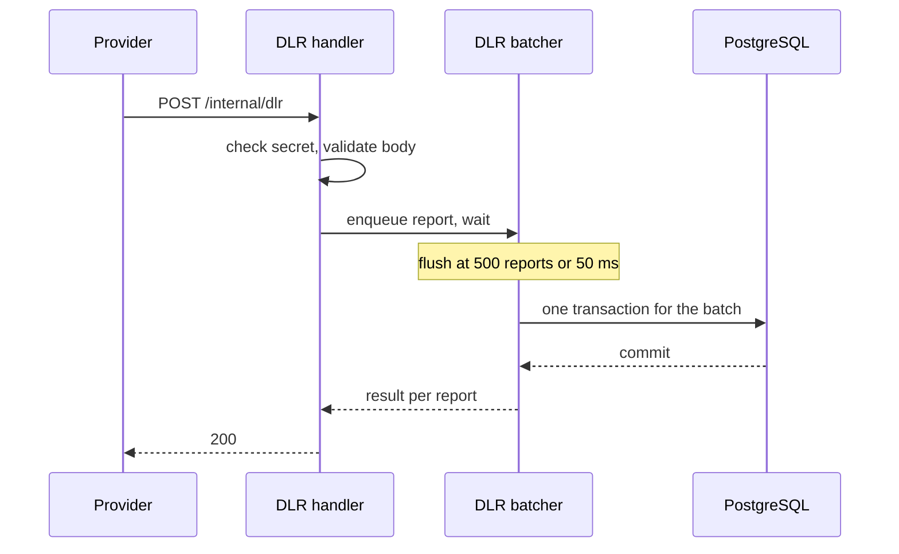

# Delivery Reports

How provider delivery reports (DLRs) are received, batched, applied, and acknowledged.

## Flow



## Handler

1. Rejects requests without the correct `X-Provider-Secret` with `401`.
2. Validates the body (see [DLR callback](../050-api/040-internal-and-provider-api.md#dlr-callback)); invalid bodies get `400`.
3. Places the report in the batcher and waits for the batch result, with a 5-second limit.
4. Responds `200` once the batch has committed, or `503` if the batch failed or the limit passed.

## Batcher

The batcher is an in-process group commit: many concurrent callbacks share one database transaction, and each callback still receives an acknowledgement only after its report is durable.

- A batch is flushed when it holds 500 reports (`DLR_BATCH_SIZE`) or 50 ms after its first report arrived (`DLR_FLUSH_INTERVAL`).
- Reports for the same message within one batch are reduced to the first one.
- If the transaction fails, every waiting handler returns `503` and the providers retry.
- On shutdown, the batcher flushes the pending batch before the HTTP server stops.

## Applying reports

```sql
UPDATE messages m
SET status = r.status,
    completed_at = now(),
    provider = COALESCE(m.provider, r.provider),
    provider_ref = COALESCE(m.provider_ref, r.provider_ref),
    updated_at = now()
FROM unnest($ids::uuid[], $statuses::text[], $providers::text[], $refs::text[])
     AS r(id, status, provider, provider_ref)
WHERE m.id = r.id
  AND m.status IN ('accepted', 'sent')
RETURNING m.id;
```

Reports that did not update a row are classified with a follow-up read, for metrics only:

| Outcome | Condition | Metric label |
|---|---|---|
| Applied | Row updated | `applied` |
| Duplicate | Message already has the reported status | `duplicate` |
| Ignored | Message is in a different terminal status (for example `failed`) | `ignored_terminal` |
| Unknown | No message with that ID (for example, its customer was deleted) | `unknown` |

All four outcomes return `200`: none of them would change by retrying.

DLRs never touch credits. An `undelivered` report does not refund; see [Credits and billing](../030-domain/020-credits-and-billing.md#refunds).

## Ordering

- **DLR before send completion.** The source statuses include `accepted`, so a DLR that overtakes the worker's `sent` commit is applied. The worker's later update records `sent_at` and the provider reference without changing the terminal status. If the message was waiting for a retry, its queue row becomes an orphan and is removed by the sweeper.
- **Late DLR for a failed message.** Ignored; see [Message lifecycle](../030-domain/010-message-lifecycle.md#rules).
- **Conflicting DLRs.** The first applied report wins, because the status is terminal after it.

## Related

- [Internal and provider APIs](../050-api/040-internal-and-provider-api.md)
- [Decision 008: DLR group commit](../110-decisions/008-dlr-group-commit.md)
- [Message lifecycle](../030-domain/010-message-lifecycle.md)
