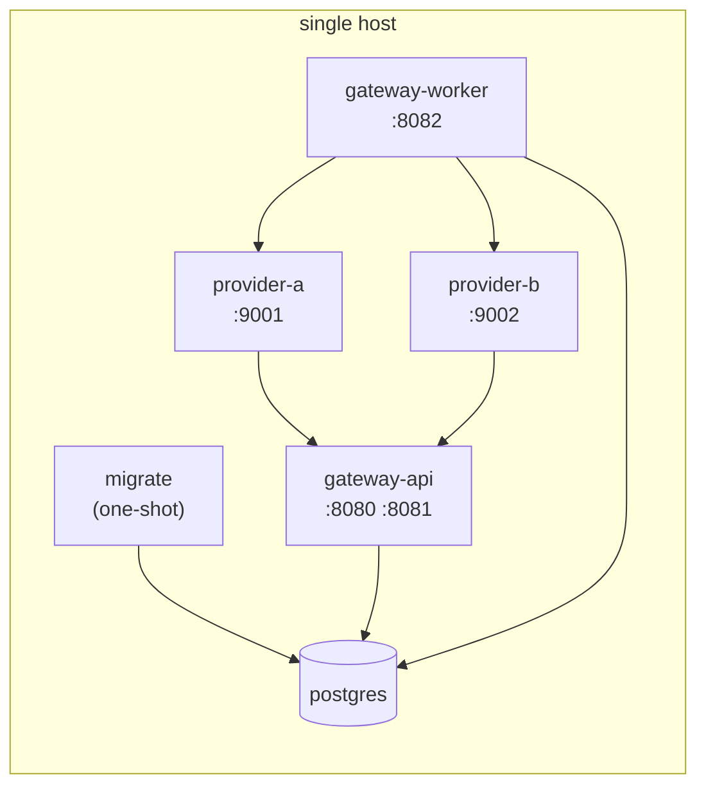
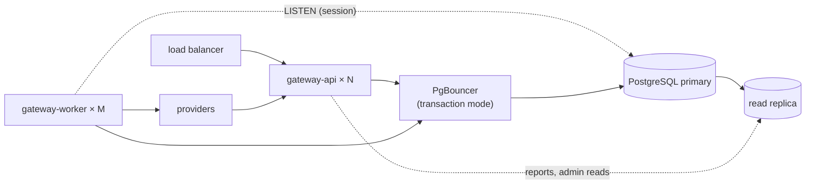

# Deployment

How the system is packaged and deployed at minimum scale, and how the same artifacts are deployed at larger scale.

## Artifacts

One container image built from `deploy/Dockerfile`:

- Build stage: the pinned Go toolchain compiles `cmd/gateway` and `cmd/provider` as static binaries with `CGO_ENABLED=0`.
- Runtime stage: a distroless static base image containing `/gateway` and `/provider`, running as a non-root user.

Migrations, OpenAPI specification, and dashboard assets are embedded in the gateway binary, so the image has no other files.

## Minimum deployment

`deploy/docker-compose.yml` runs the whole system on one host.

| Service | Command | Depends on | Health check |
|---|---|---|---|
| `postgres` | PostgreSQL 17 image, data in a named volume | — | `pg_isready` |
| `migrate` | `gateway migrate` | `postgres` healthy | Exits `0` |
| `gateway-api` | `gateway serve --role=api` | `migrate` completed | `gateway probe http://localhost:8080/readyz` |
| `gateway-worker` | `gateway serve --role=worker` | `migrate` completed | `gateway probe http://localhost:8082/readyz` |
| `provider-a` | `provider` with `PROVIDER_NAME=A` | — | `provider probe http://localhost:9001/healthz` |
| `provider-b` | `provider` with `PROVIDER_NAME=B`, `PROVIDER_ADDR=:9002` | — | `provider probe http://localhost:9002/healthz` |

Only the public port 8080 listens on all host interfaces. The admin port 8081, the providers (9001, 9002), and PostgreSQL (5432) are published on `127.0.0.1` only, for local use of the dashboard and inspection of the providers and the database. Configuration comes from `deploy/.env`; `deploy/.env.example` documents every variable with its local default.

`deploy/docker-compose.bench.yml` is an override used by `make bench`: it runs two worker instances, raises PostgreSQL memory settings, and sets the providers' latency and failure rates to zero.

## Production edge contract

`deploy/docker-compose.prod.yml` puts one Traefik in front of the single
`gateway-api` container, which serves both listeners. Three routers,
ordered by priority:

| Request | Goes to |
|---|---|
| `GET /` | Redirect to `/dashboard/` (Traefik middleware, relative target, no backend hit) |
| `PathPrefix(/admin)`, `PathPrefix(/dashboard)` | `:8081` admin server (dashboard + admin API, basic auth in app) |
| everything else on the domain | `:8080` public server (customer API, docs, health) |

The edge routes by host; the app owns paths and error envelopes, so
unknown paths get the app's JSON `not_found`, not Traefik's 404.
`/metrics` and `/internal/dlr` also listen on `:8081` but no router sends
them traffic, so they stay private. `/healthz` and `/readyz` stay
reachable for load balancers and monitors; only the compose healthchecks
use them today.

Layer ownership:

- Edge (Traefik file provider + ArvanCloud): TLS, security headers, per-IP
  edge rate limit (`rate-limit@file` on the API router only). The app sets
  none of these; `internal/httpx` owns only `X-Request-Id`, access logs,
  recovery, and request metrics.
- App: bearer/basic auth, per-customer rate limits, and every error
  envelope. Note an edge `429` is Traefik's plain response, not the
  `rate_limited` JSON envelope — clients must accept both shapes.

Host prerequisites (all outside this repo): external `proxy` and `data`
networks; file-provider middlewares `security-headers@file` and
`rate-limit@file`; Arvan bypass-cache (never cache `/v1/*`, `/admin/*`,
`/dashboard/*`) and no WAF block on `/admin`. Server `.env` must define
`APP_IMAGE`, `APP_DOMAIN`, `ADMIN_TOKEN`, `PROVIDER_SECRET`,
`DATABASE_URL`, and `PROVIDERS`. One API replica means `API_INSTANCES`
must stay `1`; the scaled topology changes that, see
[Scaling path](../080-scalability/030-scaling-path.md).

## Startup and shutdown order

1. PostgreSQL becomes healthy.
2. `migrate` applies pending migrations and exits. Migrations are idempotent, so running the job on every deployment is safe.
3. API, worker, and provider processes start in any order. Workers tolerate providers that are not yet reachable (their circuits open and close as usual); providers retry DLRs until the API is reachable.

On shutdown, processes stop accepting new work and drain in-flight work within `SHUTDOWN_TIMEOUT`; see [Queue and workers](../060-processing/010-queue-and-workers.md#shutdown). No shutdown order is required for correctness.

## Scaled deployment

The same image and configuration variables deploy the larger topology described in [Scaling path](../080-scalability/030-scaling-path.md):

| Setting | Rule |
|---|---|
| `API_INSTANCES` | Equal to N |
| `PROVIDER_RATE_LIMIT` | Provider capacity divided by M |
| `DB_MAX_CONNS` | Sized so that (N + M) × `DB_MAX_CONNS` fits PgBouncer's client limit |
| `NORMAL_LANES` | Identical on every API and worker instance |

The worker's `LISTEN` connection needs a session and connects to PostgreSQL directly, bypassing transaction-mode pooling. All other queries, including the sweeper's transaction-scoped advisory locks, work through PgBouncer.

## Security notes

- The admin port (8081) is bound to the private network in any shared environment. It carries the dashboard, the admin API, and the DLR endpoint.
- The dashboard and admin API reject cross-origin state-changing requests (Go's `http.CrossOriginProtection`), because browsers resend basic-auth credentials automatically.
- `ADMIN_TOKEN` and `PROVIDER_SECRET` are supplied as secrets, never committed. `deploy/.env.example` holds placeholder values for local use only.
- API keys are never logged. Message bodies and recipients are logged only at `debug` level.

## Related

- [Configuration](020-configuration.md)
- [Running locally](010-running-locally.md)
- [Observability](040-observability.md)
